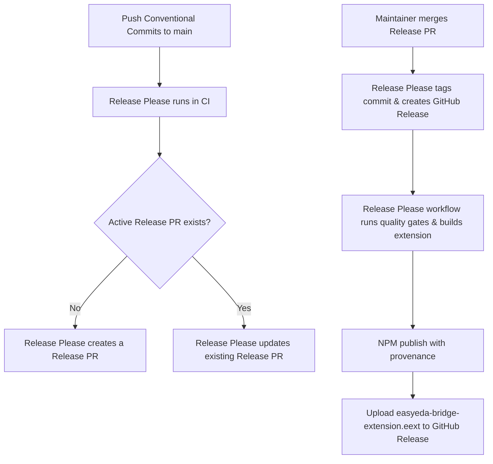

# Release Process

This document details the automated release lifecycle of `easyeda-mcp-pro`. Our delivery pipeline uses **Release Please** to automate version bumps, changelog generation, and NPM registry publications.

---

## 1. Conventional Commits

We enforce the [Conventional Commits specification](https://www.conventionalcommits.org/). Version bumping is determined by the commit prefixes pushed to `main`:

| Commit Prefix                  | SemVer Bump | Description                                                             |
| :----------------------------- | :---------- | :---------------------------------------------------------------------- |
| `fix:`                         | **Patch**   | A bug fix (e.g. `fix(bridge): resolve socket memory leak`).             |
| `feat:`                        | **Minor**   | A new feature (e.g. `feat(schematic): add component placement`).        |
| `feat!:` or `BREAKING CHANGE:` | **Major**   | A breaking change (e.g. `feat!(transport): change WebSocket protocol`). |
| `chore:`                       | **None**    | Internal updates, configs, or devDependencies.                          |
| `docs:`                        | **None**    | Documentation changes.                                                  |
| `test:`                        | **None**    | Adding/fixing tests.                                                    |
| `ci:`                          | **None**    | CI/CD configurations.                                                   |

---

## 2. Release Automation (Release Please)

We use **Release Please** to automate our releases. The lifecycle works as follows:

### Flow Details

1. **Pull Request Creation**: When changes are merged into `main`, Release Please reads the conventional commits and creates/updates a **Release Pull Request** (e.g., `chore(main): release 0.4.0`). This PR updates `package.json`, `.release-please-manifest.json`, `server.json`, `easyeda-bridge-extension/extension.json`, and appends new release notes to `CHANGELOG.md`.
2. **Release Execution**: When a maintainer merges the Release PR into `main`:
   - Release Please tags the merge commit (e.g., `v0.4.0`) and creates a GitHub Release.
   - The `Release Please` GitHub Actions workflow triggers on the push to `main` and detects the release.
   - The workflow runs full verification checks, builds the extension package (`easyeda-bridge-extension.eext`), and publishes the package to npm with `--provenance`.
   - The workflow uploads the built `easyeda-bridge-extension.eext` asset to the newly created GitHub Release.

---

## 3. NPM Publishing and Provenance

- **Provenance**: We publish with `--provenance` (enabled via `id-token: write` permission in GitHub Actions). This links the published NPM package to the specific GitHub Actions run and commit that built it, providing a cryptographic guarantee of supply-chain security.
- **Verification**: The release workflow verifies that the `NPM_TOKEN` secret is configured in the repository before publishing. If the token is missing, the workflow fails with a clear message:
  `❌ Error: NPM_TOKEN secret is not defined or is empty. Please configure it in your repository secrets.`

---

## 4. Troubleshooting Failed Releases

If a release workflow fails (e.g., due to network issues, registry timeout, or invalid token):

1. **Investigate Logs**: Go to the GitHub Actions tab, select the failed `Release Please` run, and check the logs of the failed step.
2. **Fix and Re-run**:
   - If the failure was transient (e.g., NPM registry was down), click **Re-run failed jobs**.
   - If the failure was due to an NPM token error, update the `NPM_TOKEN` secret in the repository settings and re-run.
3. **Manual Fallback**: If CI cannot publish and you must publish manually:
   - Check out the release tag: `git checkout vX.Y.Z`
   - Install dependencies: `pnpm install --frozen-lockfile`
   - Build both the server and extension: `pnpm build && pnpm build:extension`
   - Publish to npm: `npm publish --provenance` (requires local NPM login and permission).
   - Upload the generated `easyeda-bridge-extension.eext` file manually to the GitHub Release.
