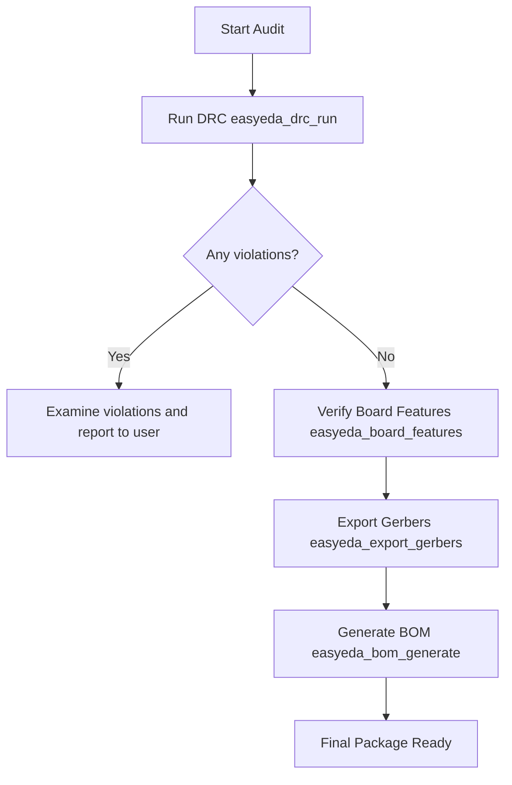

# Manufacturing Review Example Workflow

This guide details a step-by-step workflow for running a manufacturing audit on a PCB design before exporting Gerber and Drill files.

---

## The Workflow



---

## 1. Run the Design Rule Check (DRC)

First, check if the PCB layout violates any manufacturing spacing constraints:

**MCP Call**:
`easyeda_drc_run` with no parameters.

**AI Action**:
The assistant triggers a DRC run in the live editor. If there are spacing or clearance violations, it parses them:

```json
{
  "passed": false,
  "violationCount": 3,
  "violations": [
    {
      "type": "Clearance",
      "message": "Track clearance violation between Net VCC and Net GND",
      "coordinates": { "x": 142.5, "y": 88.2 }
    }
  ]
}
```

---

## 2. Inspect Board Outline & Dimensions

Before exporting, verify that board stackups and mounting holes match manufacturer capabilities:

**MCP Call**:
`easyeda_board_dimensions` and `easyeda_board_stackup`.

---

## 3. Export Fabrication Files

Once checks pass, export the production deliverables:

- **Gerbers**: Call `easyeda_export_gerbers` to generate the copper, solder mask, and silkscreen layers.
- **Centroids**: Call `easyeda_export_pick_place` to generate the pick-and-place placement map (required for assembly).
- **PDF**: Call `easyeda_export_pdf` to export documentation plots.
