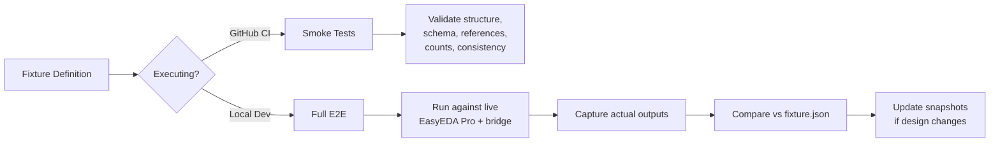

# Golden E2E Fixtures

> **Status:** Active
> **Version:** 1.0.0
> **Applies to:** easyeda-mcp-pro v0.4.0+

## What Is a Golden Fixture?

A golden fixture is a deterministic, version-controlled definition of an
expected EasyEDA Pro workflow output. It serves as both:

- **A specification** of what a valid design produces
- **A regression test** that catches unintended changes

The fixture proves the server can drive a complete workflow — from schematic
capture through manufacturing exports — not just individual API calls.

## Architecture

```
tests/fixtures/golden/
├── fixture.json               # Golden fixture definition (single source of truth)
├── fixture-schema.json         # JSON Schema for all fixtures
├── __tests__/
│   └── golden-smoke.test.ts    # CI-safe smoke validation
└── README.md                   # Manual execution instructions
```

### Execution Model: Hybrid (Manual + Smoke CI)



### CI-Safe Smoke Tests

Every PR runs `golden-smoke.test.ts` which validates:

| Check              | What It Validates                                                                      |
| ------------------ | -------------------------------------------------------------------------------------- |
| File existence     | `fixture.json` and `fixture-schema.json` are present and parseable                     |
| Schema conformance | Fixture fields match the JSON Schema                                                   |
| Component refs     | Unique, well-formed (U1, R1, C1, J1, etc.), minimum counts                             |
| Named nets         | Unique names, valid node references, critical nets exist (GND, power, I2C, UART, LEDs) |
| BOM                | Line count vs. expected, descriptions, positive quantities                             |
| ERC/DRC            | Expected error/warning counts within reasonable ranges                                 |
| Export manifest    | File count, format coverage, minimum file sizes                                        |
| Metadata           | Versions specified, `requiresLocalEasyEDA` is true                                     |
| Cross-references   | BOM refs exist in schematic, component count consistency                               |

### Full E2E (Manual/Local)

The full fixture can only be executed against a running EasyEDA Pro instance
with the bridge extension connected. This is a manual, local-only operation.

See `tests/fixtures/golden/README.md` for step-by-step instructions.

## Adding a New Fixture

1. Create a new directory under `tests/fixtures/<fixture-name>/`
2. Create `fixture.json` following the schema
3. Copy `fixture-schema.json` or reference it by path
4. Add smoke tests in `__tests__/<fixture-name>-smoke.test.ts`
5. Add manual execution instructions in `README.md`
6. Commit and push

### Fixture Design Principles

- **Deterministic**: Same input always produces same expected output
- **Self-contained**: All expected state in one `fixture.json`
- **Versioned**: Schema and fixture versions follow semver
- **Realistic**: Based on real hardware (e.g., ESP32-S3 board)
- **Minimal**: Only what's needed to prove the workflow
- **CI-safe**: Structure validation runs without EDA tools

## Current Fixtures

| Fixture  | Board                         | Components | Nets                | BOM Lines | Status |
| -------- | ----------------------------- | ---------- | ------------------- | --------- | ------ |
| `golden` | ESP32-S3 Sensor/Control Board | 28         | 27 named / 40 total | 18        | Active |

## Version Compatibility

| Component        | Required Version |
| ---------------- | ---------------- |
| EasyEDA Pro      | 2.x              |
| Bridge Extension | 0.4.0+           |
| easyeda-mcp-pro  | 0.4.0+           |
| Fixture Schema   | 1.0.0            |

## Updating Fixtures

When the server's tool outputs change (new fields, different format,
additional tools):

1. Run the full E2E against a live EasyEDA Pro instance
2. Capture the new outputs
3. Update `fixture.json` with the new expected values
4. Run `pnpm test` to ensure smoke tests still pass
5. Update `fixtureVersion` in `fixture.json`
6. If the schema changed structurally, update `schemaVersion` and the JSON Schema

## Limitations

- No EasyEDA Pro instance in CI — full E2E is manual only
- No automated snapshot comparison in smoke tests (would require live data)
- No mock bridge layer for simulating EasyEDA Pro responses
- Fixture board is not checked into version control as an EasyEDA project
  (proprietary binary format)
